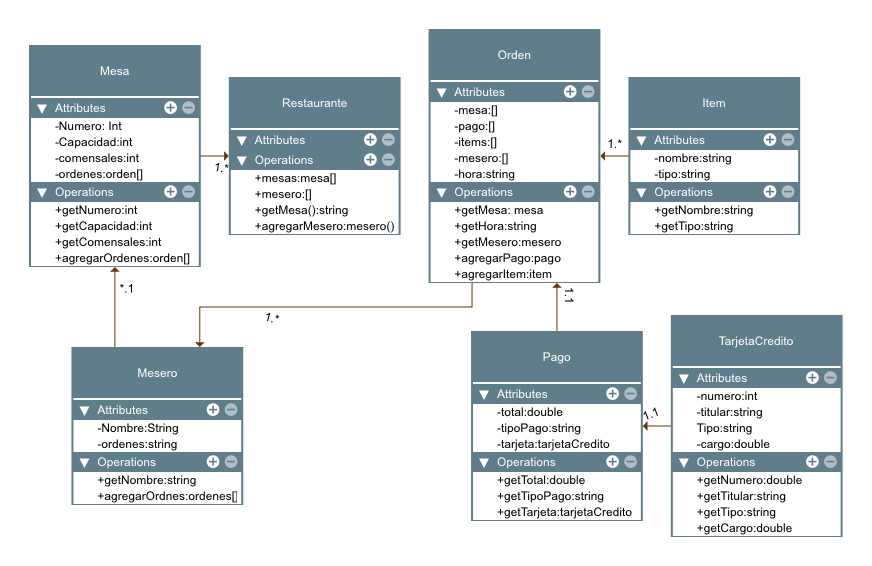

# SimulacroEntornosII
## Enunciado:

Un restaurante necesita almacenar información teniendo en cuenta los siguientes requisistos de software:

 Un cliente va a un restaurante y puede solicitar una o más órdenes de servicio.
  Se registra la mesa en la que se sienta y la cantidad de comensales. El cliente puede pedir bebidas y platos. El pedido debe registrar la hora y el camarero que le atiende.
  Por otra parte, el pago tiene tres datos: unn subtotal (lo consumido por el cliente), la propina y los impuestos por la venta realizada. En relación a esto, se debe de calcular el total del pago.
  Finalmente, el pedido se puede pagar en efectivo o con tarjeta de crédito. Si es con tarjeta de crédito se necesita saber el número de tajeta, el tipo y el nombre del titular; también se calcula el cargo por el uso de la 
  tarjeta.
## Solucion

